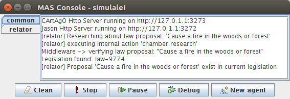

# Legislative simulation

Projeto de testes e aprendizado com simulações sociais avaliando ações dos agentes através de consultas sobre leis em ontologias. Utiliza o middleware [AgentDevLaw](https://github.com/fabiosperotto/agentdevlaw) em seu último release. Usa como plataforma o ambiente [JaCaMo](http://jacamo.sourceforge.net).

Existem dois exemplos de simulação. O primeiro é dos agentes procurando se suas ações combinam com alguma lesgislação existente e verificando por sanções. A segunda, trata da simulação da criação de uma nova lei. O fluxo inicia pelo agente relator e pode passar pelo presidente da comissão e por todos os processo de votação com deputados, senadores e sanção da presidência. Veja o arquivo .jcm para ativar uma ou outra simulação, comentando e descomentado os agentes necessários.

Veja os screenshots para melhor entendimento.

-----------------

A project of tests and learning with social simulations evaluating agents' actions through law queries in ontologies. Uses the middleware [AgentDevLaw](https://github.com/fabiosperotto/agentdevlaw) in its last release. Uses the [JaCaMo](http://jacamo.sourceforge.net) platform.

There are two examples of simulation. The first is about the agents searching if it actions match with existing legislation and verifying by sanctions. The second deals with a simulation of new law creation. The flow begins with the Relator agent and can pass by commission president and for all processes of polls with deputies, senators, and the presidency sanction. See the .jcm file to activate on or other simulation, commenting and uncommenting the necessaries agents.


## Informação

- Exemplo de Jason internal action em /src/agt/eval/action.java (Jason);
- Exemplo de artefato Cartago em /src/env/simulalei, neste caso utiliza uma biblioteca de comunicação com uma ontologia que procura ações e retorna informações sobre leis. 

## Settings

- Para incluir a biblioteca agentdevlaw.jar (ou outras), insira a mesma em /lib. Depois clique com o botão direito na biblioteca e selecione a opção Build Path > Add Build Path, a mesma será referenciada em Referenced Libraries tornando-se funcional na aplicação (Jason ou Cartago). Para remover a biblioteca de Referenced Libraries, clique com o botão direito na mesma referenciada e siga nas opções Build Path > Remove from Build Path.

## Javadoc
A documentação da biblioteca encontra-se em /doc, inclua o arquivo .zip clicando com botão direito na biblioteca em Referenced libraries > Properties > Javadoc Location > Javadoc archive.


## Configurações
Inserir agentdevlaw.jar no build path da aplicação (uma cópia deste encontra-se no diretório /lib/agentdevlaw.jar). Na IDE Eclipse: botão direito na biblioteca > Build Path > Add to Build Path.
Após inserir no build path, e independente da utilização com artefatos Cartago ou ação interna Jason, poderá ser utilizado como:
```java
OntologyConfigurator ontology = new OntologyConfigurator(); //classe de configuracao para com a ontologia
ontology.setOrigin(OntologyConfigurator.SERVER); //existem duas opcoes da origem da ontologia: 
//SERVER = ontologia esta sendo fornecida por um webservice (Fuseki), 
//MODEL = ontologia consta em arquivo OWL em um diretorio acessivel pela simulacao (ver config.properties)
		
QueryProcess middleware = new QueryProcess(ontology); //processador de consultas
		
List<Law> laws =  middleware.searchAction(String action, String agentRole); //realiza a busca de leis 
//na ontologia, de acordo com uma string de acao do agente e qual o seu papel na sociedade em simulacao 
//(nao obrigatorio, aceita string vazia), 
//retorna uma lista de leis caso as encontrar, ver exemplos de codigo neste projeto
```

## Screenshots


Results from the agents' simulations searching some legislation.


The results for a simulation of congress in creating a new law. The flow starts with a relator searching if a law proposal already exists in the legal ontology. If not, he sends this proposal to the president of his commission, that proposes the new law. Then, this politician send the proposal to the president of the deputies and the this president start an election to vote on the proposal, waiting for all deputies to vote. If the most deputies vote in favor of the new law, the proposal is sent to the president of the senate. The president of the senate makes the same flow: provides an election about this law and if the senators approve the proposal, the new law is sent to the president of the republic. This last agent will use the middleware to create a new law that updating the legal ontology and informs the other presidents when this is finished.


This is the same simulation flow describe before. But in this case, from their elections, the senators not agree with the deputies and not approves the new law proposal.



Here the Relator agent finds legislation that exactly match with the proposal and the process of creating a new legal is canceled.


This is the debug window of the president of the senate when the simulation is finished. His belief describes that all senators votes and the approved law proposal. The belief 'law_published' is sent from the republic president and informs that law was published with a specific number (8746 in this example).


The debug window of the president of the commission that propose the new law. This agent receives communication and beliefs from Relator and the Deputies President.